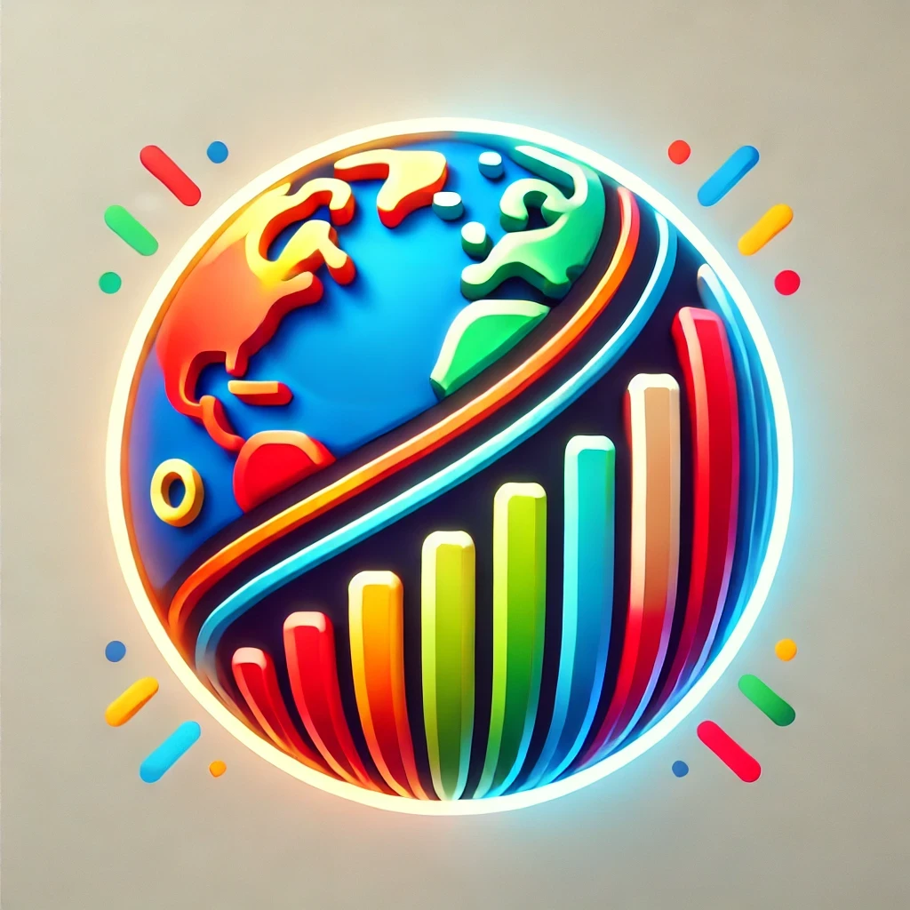

# :earth_americas: GDP dashboard template


This interactive application, built with **Streamlit**, allows users to visualize the **Gross Domestic Product (GDP)** data of multiple countries over time. The data is sourced from the **World Bank Open Data**.

---

## **Key Features** 🛠️  

### **1. Date Range Selection**  
   - Users can adjust a date range slider from **1960 to 2022** to explore specific time periods.

### **2. Country Selection**  
   - An interface allows users to select multiple countries (e.g., **DEU** for Germany, **FRA** for France) to compare their GDP data.

### **3. GDP Visualization Over Time**  
   - A dynamic chart displays the **GDP trends** of the selected countries over the chosen time period.

---

## **Objective** 🎯  
The application helps users explore and analyze **global economic trends** in a simple and intuitive way, leveraging Streamlit's powerful visualization tools.

### **Technologies Used** ⚙️
- Streamlit
- Python
- World Bank Open Data
---

## **How to Run the App** 🚀  

You can simply access the project via Stramlit interface:
[](https://gdp-dashboard-template.streamlit.app/)


### How to run it on your own machine

1. Install the requirements

   ```
   $ pip install -r requirements.txt
   ```

2. Run the app

   ```
   $ streamlit run streamlit_app.py
   ```
